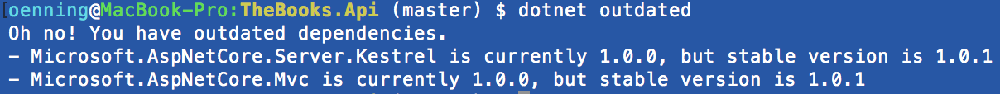

dotnet-outdated
===

`dotnet-outdated` is a tool to check for outdated .NET Core dependencies.

### How To Install

Add `DotNetOutdated` to the `tools` section of your `project.json` file:

```
{
...
  "tools": {
    "DotNetOutdated": "1.2.2"
  }
...
}
```

### How To Use

```
dotnet outdated
```

### An example of what to expect



`Yellow` is for non-major version available to update. It's generally safe to update so you should do it.

`Red` is for new **MAJOR** updates which may possible break something in your code. You should read the docs before updating.